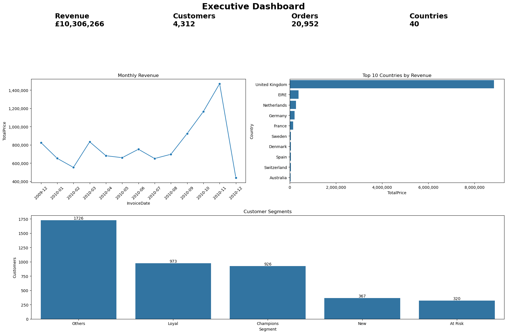

# Customer Segmentation using RFM Analysis and K-Means

<p align="center">

</p>

## Overview

This project analyzes over **525,000 retail transactions** to identify customer segments based on purchasing behavior. After performing data cleaning and exploratory data analysis, customers are segmented using the **RFM (Recency, Frequency, Monetary)** framework and **K-Means clustering**. The results are then translated into actionable business recommendations to support marketing and customer retention strategies.

---

## Business Problem

**How can customers be segmented according to their purchasing behavior in order to improve marketing effectiveness, customer retention, and long-term profitability?**

---

## Dataset

- **Source:** UCI Online Retail Dataset
- **Period:** December 2009 – December 2010
- **Transactions:** 525,461
- **Customers:** 4,383
- **Countries:** 40

---

## Project Workflow

- Exploratory Data Analysis (EDA)
- Data Cleaning & Preparation
- Sales Trend Analysis
- RFM Customer Segmentation
- K-Means Clustering
- Business Insights
- Executive Dashboard

---

## Technologies Used

- Python
- Pandas
- NumPy
- Matplotlib
- Seaborn
- Scikit-learn
- Plotly
- Jupyter Notebook

---

## Key Findings

- More than **92% of total revenue** comes from the United Kingdom.
- Sales show a clear upward trend throughout 2010, with a significant increase during the final quarter of the year.
- Customers were successfully segmented using both **RFM analysis** and **K-Means clustering**.
- Four distinct customer groups were identified, each requiring different marketing strategies.
- The analysis demonstrates how customer segmentation can support data-driven business decisions.

---

## Business Recommendations

- **Champions:** Reward loyalty through exclusive offers and early access to new products.
- **Regular Customers:** Increase engagement with personalized promotions and retention campaigns.
- **New / Occasional Customers:** Encourage repeat purchases through welcome offers and product recommendations.
- **Inactive Customers:** Implement targeted reactivation campaigns and evaluate their cost-effectiveness.

---

## Project Structure

```
├── data/
│   ├── raw/
│   └── processed/
│
├── notebooks/
│   └── Customer_Segmentation.ipynb
│
├── images/
│
├── README.md
│
└── requirements.txt
```

---

## Future Improvements

- Customer Lifetime Value (CLV) prediction
- Customer churn prediction
- Alternative clustering techniques (Hierarchical Clustering, DBSCAN)
- Interactive dashboard using Power BI or Tableau

---

## Author

**Elías Balbaneda Herreros**

LinkedIn: https://linkedin.com/in/elias-balbaneda-herreros
